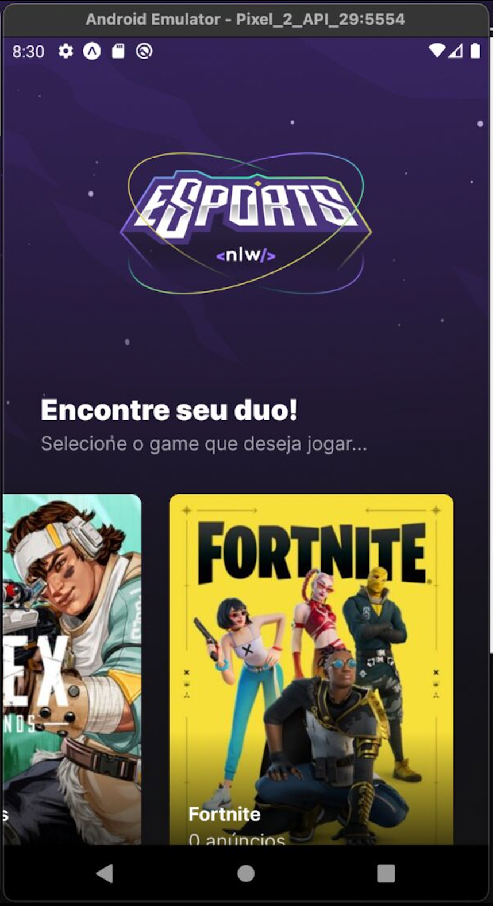
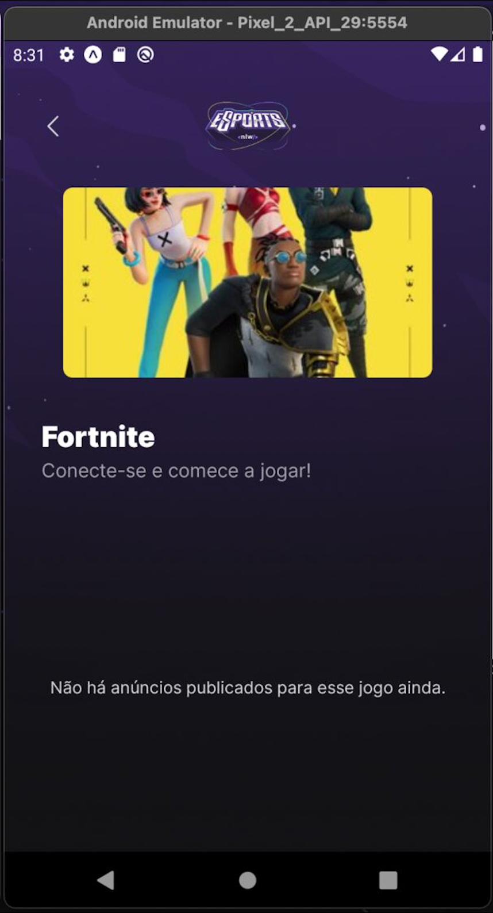
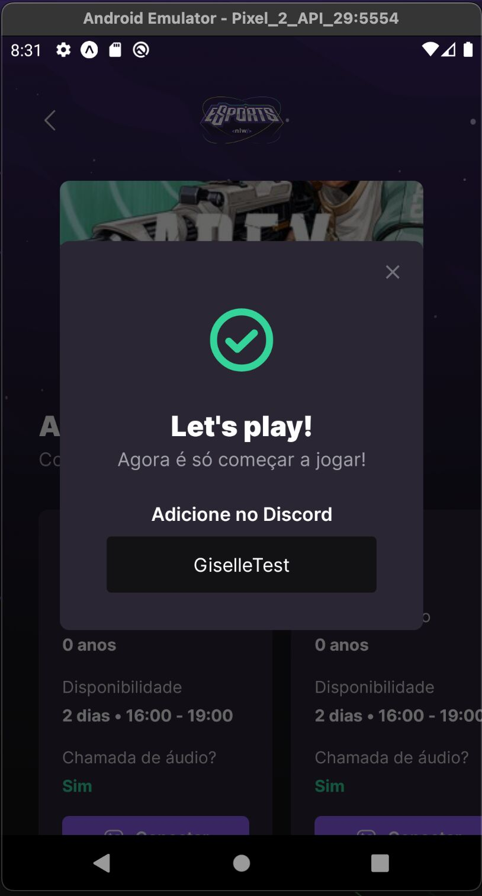

# Find your duo mobile

This project was developed during the NLW Bootcamp by Rocketseat. The project is a web application that allows you to find a duo to play your favorite games. The project is divided into two repositories, the [server](https://github.com/gihoekveld/find-your-duo-server), the [web](https://github.com/gihoekveld/find-your-duo-web) and the [mobile](https://github.com/gihoekveld/find-your-duo-mobile).

## Technologies used ☕️ 🐍

- React Native
- Typescript
- React Navigation
- Phosphor React Icons

## Features 🚀

- List all games
- List ads by game
- Get discord by ad

## Screenshots 📷

<div style="display:flex; flex-wrap:wrap;">



</div>

## Installation 💻

Clone the repository

```bash
git clone
cd find-your-duo-mobile
npm install
```

## Usage 📖

```bash
npm start
```

## Acknowledgments

> This project was developed during the Ignite Bootcamp by Rocketseat.


